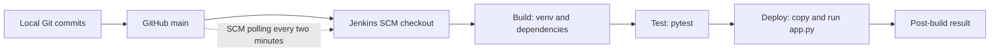

# Lab 1 - DevOps Foundations & Continuous Integration

**Course:** DevOps and Automation Lab (ENSP461)  
**Student:** Ansh Kapoor | **GitHub:** `axdy02`  
**Application:** Python addition demo with a Jenkins build, test and local deployment pipeline.

This repository is the submission entry point. It contains the application, version-controlled pipeline, experiment report, command reference and original practical screenshots. An evaluator can review the work directly on GitHub without access to the local Jenkins server.

## Start here

| Document | Contents |
|---|---|
| [Complete lab report](REPORT.md) | Q1-Q7: objectives, implementation, results, observations and limitations |
| [Evidence gallery](docs/EVIDENCE.md) | 29 original screenshots, readable detail crops and requirement mapping |
| [Environment setup](docs/SETUP.md) | Ubuntu/WSL, Git, Java and Jenkins setup and verification |
| [Git workflow and history](docs/GIT_WORKFLOW.md) | Initialization, staging, commits, branches, merging and GitHub push |
| [Jenkins job and pipeline](docs/JENKINS.md) | Job settings, Build/Test/Deploy, SCM polling and reproduction |
| [Command reference](commands.txt) | Reconstructed commands, clearly separated from actual output |
| [Submission checklist](docs/CHECKLIST.md) | Confirmed results, remaining evidence and optional improvements |
| [Evidence provenance](docs/PROVENANCE.md) | Sources, repository review baseline and authenticity notes |

## Workflow



The pipeline definition is [Jenkinsfile](Jenkinsfile). Its Deploy stage stages and executes a command-line application inside the Jenkins workspace. It does **not** publish a website, create a persistent service or deploy to a remote server.

## Results visible in the evidence

Jenkins build **#1** shows **2 passed**, the application output `2 + 3 = 5`, and **Finished: SUCCESS**. The build-history screenshot shows builds **#1 and #2** successful.


[Original full console screenshot](docs/evidence/screenshots/ss22-jenkins-console.png) | [Successful build history](docs/evidence/screenshots/ss25-builds-successful.png)

**Evidence still to attach:** a build's trigger-cause line or polling log proving the SCM-triggered start, the top of a console log showing GitHub checkout, and full exported console logs. The current Jenkinsfile configures polling, but a second green build alone does not establish why it started. See the [short completion checklist](docs/CHECKLIST.md).

## Lab requirement map

| Question | Implementation / documentation | Practical evidence |
|---|---|---|
| Q1 - Install and configure Git and Jenkins | [Setup](docs/SETUP.md) | [SS01-SS09](docs/EVIDENCE.md#q1-installation-and-configuration) |
| Q2 - Git version control | [Git workflow](docs/GIT_WORKFLOW.md) | [SS10-SS20](docs/EVIDENCE.md#q2-version-control) |
| Q3 - Basic Jenkins CI/CD pipeline | [Job configuration](docs/JENKINS.md), [Jenkinsfile](Jenkinsfile) | [SS21-SS25](docs/EVIDENCE.md#q3-q5-pipeline-testing-and-local-deployment) |
| Q4 - Build, test and deploy stages | [Jenkinsfile](Jenkinsfile), [report](REPORT.md#q4---create-a-jenkinsfile-defining-pipeline-stages) | [Jenkins console](docs/evidence/screenshots/ss22-jenkins-console.png) |
| Q5 - Automated deployment | [SCM polling and local deployment](docs/JENKINS.md) | [Results and trigger-proof gap](docs/CHECKLIST.md) |
| Q6 - Commands, configurations, history and observations | [Commands](commands.txt), [gallery](docs/EVIDENCE.md), [history](docs/GIT_WORKFLOW.md) | [Log capture guide](docs/evidence/logs/README.md) |
| Q7 - CI/CD workflow report | [Complete report](REPORT.md) | Linked screenshots throughout |

## Run the application locally

In an Ubuntu terminal with Python 3 and `python3-venv` installed:

```bash
git clone https://github.com/axdy02/devops-lab1.git
cd devops-lab1
python3 -m venv venv
. venv/bin/activate
python -m pip install -r requirements.txt
python app.py
python -m pytest -v
```

For an existing local checkout, enter that directory instead of cloning again.

The tests check `add(2, 3) == 5` and `add(-2, -3) == -5`. The dependency file currently contains unpinned `pytest`; therefore a new installation is not guaranteed to reproduce the exact dependency versions from the screenshots.

## Main files

```text
app.py                 Sample command-line application
test_app.py            Two pytest tests
requirements.txt       Test dependency
Jenkinsfile            Declarative Build -> Test -> Deploy pipeline
README.md              Submission entry point
REPORT.md              Full experiment report
commands.txt           Reconstructed command reference
docs/                  Setup, Git, Jenkins, evidence and checklist
scripts/               Optional real-output capture helper
```

The original task descriptions and general lab instructions are included under [docs/requirements](docs/requirements). The observed environment and historical evidence are documented as captured, not presented as a live service-status check.
