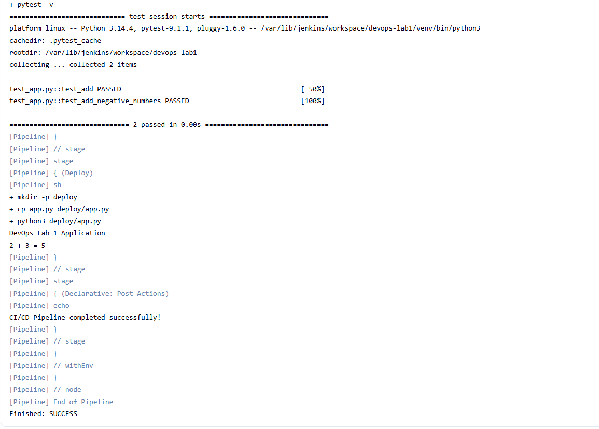
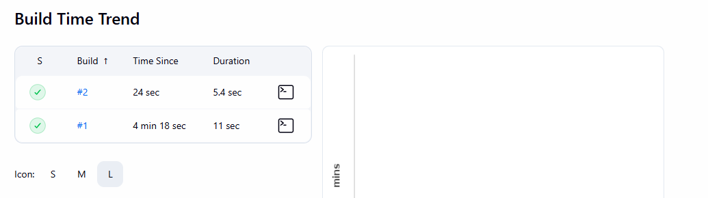

# Lab 1 Report - DevOps Foundations & Continuous Integration

**Course:** DevOps and Automation Lab (ENSP461)  
**Student:** Ansh Kapoor  
**Repository:** https://github.com/axdy02/devops-lab1  
**Environment used:** Ubuntu in WSL2 on Windows  
**Application language:** Python | **Pipeline syntax:** Declarative Jenkins Pipeline

[Repository overview](README.md) | [Evidence gallery](docs/EVIDENCE.md) | [Completion checklist](docs/CHECKLIST.md)

## 1. Aim

To establish a foundational DevOps workflow for a sample application using Git-based source control, GitHub, Jenkins continuous integration, automated tests and a local build-and-deploy demonstration. The work maintains source code and pipeline configuration in version control and records practical evidence for each experiment.

## 2. Scope and evidence basis

The report follows the seven tasks in the [Lab 1 assignment](docs/requirements/lab1-tasks.png). The [general instructions](docs/requirements/general-instructions.png) identify the GitHub repository as the primary evidence of practical work and require commands, configuration, screenshots, logs and observations.

The observed outcomes below come from the student's original screenshots and repository contents. Instructions for reproducing the work are distinguished from captured results. In particular, the implementation uses a local command-line deployment demonstration; it does not claim a production or remotely hosted deployment.

## 3. Tools and observed versions

| Component | Observed value / role | Evidence |
|---|---|---|
| Ubuntu | 26.04.1 LTS, codename resolute | [SS01](docs/evidence/screenshots/ss01-ubuntu-version.png) |
| Git | 2.53.0 | [SS02](docs/evidence/screenshots/ss02-git-version.png) |
| OpenJDK | 21.0.12.1 | [SS03](docs/evidence/screenshots/ss03-java-version.png) |
| systemd | running | [SS04](docs/evidence/screenshots/ss04-systemd-running.png) |
| Jenkins | 2.580.1 | [SS05](docs/evidence/screenshots/ss05-jenkins-version.png) |
| Jenkins service | Enabled and active (running) when captured | [SS06](docs/evidence/screenshots/ss06-jenkins-service.png) |
| Python | 3.14.4 in the captured test session | [SS13](docs/evidence/screenshots/ss13-local-tests.png), [SS22](docs/evidence/screenshots/ss22-jenkins-console.png) |
| pytest | 9.1.1 in the captured test session | [SS22](docs/evidence/screenshots/ss22-jenkins-console.png) |
| GitHub | Repository owner axdy02, primary branch main | [SS20](docs/evidence/screenshots/ss20-github-source.png) |

These are the versions visible in this experiment, not minimum-version requirements or a claim about the latest releases. Docker was available on the host but was not used for this Lab 1 pipeline.

## Q1 - Install and configure Git and Jenkins

### Objective

Install and configure Git and Jenkins, verify the environment and configure the Git user name and email. The task specifically requests Git on Ubuntu Linux.

### Procedure

Ubuntu was opened through WSL2. The Linux version and systemd state were checked before Jenkins setup. Git and a Java 21 runtime were installed, the Jenkins LTS package repository was configured, and Jenkins was started as a systemd service. The browser setup wizard was completed, including plugin installation and creation of an administrator account.

Global Git identity was configured for commits. The captured configuration shows `user.name=axdy02` and a configured `user.email`. The earlier command reference used the display-name example Ansh Kapoor; this report records the actual captured value instead of implying that the example was the observed configuration.

### Verification commands

```bash
lsb_release -a
git --version
java -version
systemctl is-system-running
jenkins --version
systemctl status jenkins --no-pager
git config --global --get user.name
git config --global --get user.email
```

Administrator passwords and GitHub access tokens are not part of the required report evidence. They must not be committed with the project.

### Result and observations

The screenshots confirm the Ubuntu environment, installed tools, running Jenkins service, setup page and configured dashboard. Git identity is visible in the evidence. The practical uses Ubuntu within Windows rather than a native Windows Jenkins installation.

**Evidence:** [SS01-SS09](docs/EVIDENCE.md#q1-installation-and-configuration).  
**Reproduction detail:** [Environment setup](docs/SETUP.md).

## Q2 - Set up version control using Git

### Objective

Initialize a repository, stage and commit changes, create and merge branches, and push the repository to GitHub.

### Application and tests

The sample application exposes an `add(a, b)` function and prints a small demonstration when run as a script. Keeping the application small makes the Git and CI/CD operations easy to inspect.

| Test | Input | Assertion |
|---|---|---|
| test_add | 2, 3 | Result equals 5 |
| test_add_negative_numbers | -2, -3 | Result equals -5 |

The application has no web interface or long-running server. The two tests cover two simple numerical cases, not comprehensive input validation or broad application coverage.

### Procedure

The repository was created in `/home/user/devops-lab1`, initialized with Git and placed on `main`. `app.py` and `README.md` were staged and committed. The `feature-tests` branch was created to add `test_app.py`, `requirements.txt` and `.gitignore`. Tests were executed in a Python virtual environment. The branch was then merged into `main`.

A second branch, `docs-update`, was used to document the planned pipeline stages. The decorated local Git history shows both branch names. A GitHub repository was created, the HTTPS origin was configured, and `main` was pushed after GitHub CLI authentication.

### Recorded development history

| Short commit | Recorded change |
|---|---|
| 2719c1e | Initial Python application setup |
| 1235e08 | Add unit tests with pytest |
| 548ad41 | Document CI/CD pipeline stages |
| 8b7f655 | Add Jenkins CI/CD pipeline |
| c02a681 | Test automated Jenkins trigger |
| a5b3788 | Add Lab 1 command documentation |
| 5071511 | Add Lab 1 CI/CD workflow report |

This is the history before the expanded documentation pack is committed. The current repository will acquire additional documentation/evidence commits after this report is uploaded.

### Result and observations

Initialization, the first commit, branch creation, the feature-branch fast-forward merge, decorated history, successful GitHub push and uploaded source files are all visible. A fast-forward merge produces a linear history; a separate merge commit is not required for it to be a valid merge.

At the review baseline, GitHub listed only `main`. The two feature branches were demonstrated locally; the report does not claim they were already pushed to GitHub. Publishing those existing branches is an optional evidence improvement, not a reason to recreate or rewrite the history.

**Evidence:** [SS10-SS20](docs/EVIDENCE.md#q2-version-control).  
**Commands and commit links:** [Git workflow](docs/GIT_WORKFLOW.md).

## Q3 - Implement a basic Jenkins CI/CD pipeline

### Objective

Configure Jenkins to obtain source from the GitHub repository and run an automated build.

### Configuration

The intended job is named `devops-lab1` and uses **Pipeline script from SCM**. Its SCM is Git, the repository is `https://github.com/axdy02/devops-lab1.git`, the branch specification is `*/main`, and the script path is `Jenkinsfile`. The repository is public, so its read-only checkout does not require the student's personal GitHub CLI login to be copied to the Jenkins service account.

The local setup and the Jenkins workspace are separate directories:

```text
Developer checkout: /home/user/devops-lab1
Jenkins workspace:  /var/lib/jenkins/workspace/devops-lab1
```

The latter path is visible in the captured Jenkins test console. The job settings are documented for reproduction, but a settings screenshot has not yet been included in the supplied evidence.

### Result and evidence limitation

Jenkins build #1 completed successfully, as shown by the console and build-history evidence. The visible console section confirms the tests and local deployment ran inside the Jenkins workspace. Its top section, which would explicitly show the GitHub checkout and commit, is outside the captured viewport.

For a complete repository-only audit trail, attach the top of that console or the full console export as described in the checklist. This report does not substitute an inferred checkout log for actual output.

**Evidence:** [Pipeline file on GitHub](docs/evidence/screenshots/ss21-github-jenkinsfile.png), [full available console screenshot](docs/evidence/screenshots/ss22-jenkins-console.png).  
**Reproduction detail:** [Jenkins job setup](docs/JENKINS.md).

## Q4 - Create a Jenkinsfile defining pipeline stages

### Objective

Define Build, Test and Deploy stages in a declarative or scripted Jenkins pipeline and demonstrate execution.

### Implementation

The repository's [Jenkinsfile](Jenkinsfile) uses a declarative `pipeline` block, `agent any`, three ordered stages and success/failure post conditions.

| Stage | Commands in the implementation | Purpose |
|---|---|---|
| Build | Create `venv`, activate it, install requirements, run `python3 -m compileall app.py` | Prepare dependencies and byte-compile the Python source |
| Test | Activate `venv`; execute `pytest -v` | Run both unit tests |
| Deploy | Create `deploy`; copy `app.py`; run `python3 deploy/app.py` | Demonstrate local staging and execute the copied application |
| Post conditions | Echo success or failure text | Record the pipeline outcome |

The Build stage does not produce a wheel, container image or standalone executable. The virtual environment is prepared in the Jenkins workspace, not reused from the student's home directory. Tests and deployment are separate pipeline stages even though the application is intentionally small.

### Observed output

The original Jenkins console includes:

```text
test_app.py::test_add PASSED
test_app.py::test_add_negative_numbers PASSED
2 passed in 0.00s
[Pipeline] { (Deploy)
+ mkdir -p deploy
+ cp app.py deploy/app.py
+ python3 deploy/app.py
DevOps Lab 1 Application
2 + 3 = 5
CI/CD Pipeline completed successfully!
Finished: SUCCESS
```

This is a selected transcription, not the complete raw log. The original screenshot remains the primary evidence.



**Result:** the captured Jenkins run passed its two tests, executed the local Deploy stage and finished successfully. Only the success path is observed; the configured failure post condition has not been demonstrated with an intentionally failing build.

## Q5 - Automate application deployment

### Objective

Use Jenkins build triggers, post-build actions and deployment steps to automate the application workflow.

### Trigger configuration

The Jenkinsfile contains:

```groovy
triggers {
    pollSCM('H/2 * * * *')
}
```

This tells Jenkins to poll for source changes on a roughly two-minute schedule. It is change-based polling, not an unconditional build every two minutes and not a GitHub webhook. Jenkins and its WSL environment must be running to perform the polling. The official [Pipeline syntax reference](https://www.jenkins.io/doc/book/pipeline/syntax/#triggers) documents this distinction.

### Deployment and post-build actions

After the test stage succeeds, the pipeline creates a workspace `deploy/` directory, copies the Python application into it and runs the copy. The observed success message is emitted by the `post { success { ... } }` block. A separate failure block exists in source but its execution is not part of the captured results.

### Observed automation evidence

The repository contains the commit `c02a681`, titled **Test automated Jenkins trigger**. The supplied Build Time Trend screenshots show a second build appearing and then completing successfully. Build #1 took 11 seconds and build #2 took 5.4 seconds in that view.



These facts are consistent with the intended polling workflow, but the screenshots do not display the build's cause. Therefore, the specific statement that build #2 was started by SCM rather than a manual click still needs a trigger-cause screenshot or polling-log export. See [required finishing evidence](docs/CHECKLIST.md#1-attach-direct-trigger-and-checkout-evidence).

### Deployment scope

This is a **local staging and execution demonstration inside the Jenkins workspace**. It is not a persistent deployment outside that workspace. No remote host, service supervisor, public endpoint, rollback mechanism or container deployment is claimed.

The supplied task does not name a specific deployment target. Faculty acceptance of this minimal target must be confirmed if the assessed lab expects a running service or independent server. A report alone cannot resolve that interpretation.

## Q6 - Record commands, configuration, screenshots and observations

The repository documents commands in [commands.txt](commands.txt), job settings in [docs/JENKINS.md](docs/JENKINS.md), pipeline configuration in [Jenkinsfile](Jenkinsfile), history in [docs/GIT_WORKFLOW.md](docs/GIT_WORKFLOW.md), and screenshots in the [evidence gallery](docs/EVIDENCE.md).

The command file is a reconstructed reference from the procedure and supplied evidence. It is not presented as a verbatim export of the student's complete shell history. Installation verification is captured; full historical installation logs were not supplied.

The optional [capture helper](scripts/capture-evidence.sh) records fresh environment, Git history, branch and Jenkins service output from the actual lab machine. [Console export instructions](docs/evidence/logs/README.md) explain how to attach the full Jenkins logs. These fresh logs must be generated on the student's machine; empty or invented success logs are not included.

### Principal observations

- A running Java runtime and systemd service were prerequisites for the Jenkins setup used here.
- Version control separated application, testing and documentation changes into identifiable commits.
- The source screenshots demonstrate a valid fast-forward branch merge.
- Both numerical test cases passed locally and in the Jenkins console.
- Jenkins ran under its own workspace, separate from the developer's checkout.
- The local deployment stage produced the expected `2 + 3 = 5` output.
- SCM polling is configured, while direct evidence of the trigger cause remains to be attached.
- Test dependencies are not version-pinned; reproducibility is procedural rather than fully locked to identical packages.

## Q7 - Prepare a CI/CD workflow report

This report, the repository landing page and the supporting documentation describe the pipeline architecture, stages, automation configuration, observed results, limitations and supporting screenshots. The experiment's primary evidence is now organized for review through a single GitHub repository link once the documentation pack has been uploaded.

### Architecture

```text
Windows host
  |
  +-- Browser: local Jenkins UI at localhost:8080
  |
  +-- Ubuntu / WSL2
        |
        +-- Developer Git checkout -- push --> GitHub main
        |
        +-- Jenkins service
              |
              +-- SCM checkout / source polling
              +-- Build: virtual environment and dependencies
              +-- Test: pytest (two assertions)
              +-- Deploy: copy and execute app.py
              +-- Post: record success or failure
```

A GitHub evaluator does not need access to `localhost:8080`; that address refers to the student's own computer. The repository must contain the screenshots and exported evidence instead.

## 4. Overall result

Git setup, branching, merging, pushing and a successful Jenkins test-and-local-deployment run are supported by the supplied evidence. The source contains the requested Build, Test and Deploy stages, SCM polling and post-build result handling.

Before final assessment, add the direct trigger-cause/checkout evidence and raw console exports, then review the [submission checklist](docs/CHECKLIST.md). No claim is made that these missing screenshots have already been collected. Faculty approval of the chosen environment and deployment scope remains an assessment matter, not something inferable from a successful build.

## 5. Conclusion

The experiment establishes a small, inspectable Git-to-Jenkins workflow for a Python application. It demonstrates meaningful source history, repeatable pipeline configuration, automatic unit-test execution and a local deployment smoke test. The documentation separates configured behavior, observed results and outstanding evidence so the repository can be evaluated without overstating what was demonstrated.
