# Practical evidence gallery

[Overview](../README.md) | [Complete report](../REPORT.md) | [Checklist](CHECKLIST.md)

The 29 numbered images below are the original embedded PNGs extracted from **Devops lab 1 evidence.docx**, without resampling or altered text. The two letter-suffixed images are labelled detail crops of originals, included for readability. The original numbering follows document order and may differ from earlier chat screenshot labels.

Each caption states what the image actually establishes. Open an image to view it at its native size. A screenshot of a successful build does not by itself establish the trigger cause.

## Quick access

- [Jenkins tests, deployment and success (readable crop)](evidence/screenshots/ss22a-console-detail.png)
- [Original full Jenkins console](evidence/screenshots/ss22-jenkins-console.png)
- [Two successful builds](evidence/screenshots/ss25-builds-successful.png)
- [Remaining trigger/checkout evidence](CHECKLIST.md#1-attach-direct-trigger-and-checkout-evidence)
- [Screenshot source and integrity manifest](evidence/manifest.json)

## Q1 installation and configuration

### SS01 - Ubuntu environment

**Requirement:** Q1 | **Original document page:** 1

Ubuntu 26.04.1 LTS (resolute) is shown by lsb_release -a.

Open screenshot SS01

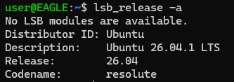

[View original-size PNG](evidence/screenshots/ss01-ubuntu-version.png)

### SS02 - Git installation

**Requirement:** Q1 | **Original document page:** 1

git --version reports Git 2.53.0.

Open screenshot SS02

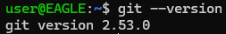

[View original-size PNG](evidence/screenshots/ss02-git-version.png)

### SS03 - Java installation

**Requirement:** Q1 | **Original document page:** 1

java -version reports OpenJDK 21.0.12.1.

Open screenshot SS03

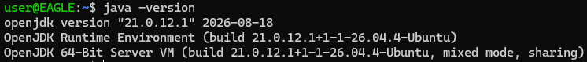

[View original-size PNG](evidence/screenshots/ss03-java-version.png)

### SS04 - systemd health

**Requirement:** Q1 | **Original document page:** 1

systemctl is-system-running reports running.

Open screenshot SS04

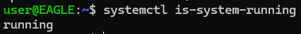

[View original-size PNG](evidence/screenshots/ss04-systemd-running.png)

### SS05 - Jenkins installation

**Requirement:** Q1 | **Original document page:** 1

jenkins --version reports 2.580.1.

Open screenshot SS05

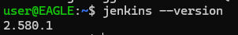

[View original-size PNG](evidence/screenshots/ss05-jenkins-version.png)

### SS06 - Jenkins service

**Requirement:** Q1 | **Original document page:** 1

The service is enabled and active (running).

Open screenshot SS06

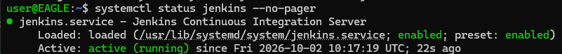

[View original-size PNG](evidence/screenshots/ss06-jenkins-service.png)

### SS07 - Jenkins initial setup

**Requirement:** Q1 | **Original document page:** 1

The Unlock Jenkins page is visible. The password field is empty.

Open screenshot SS07

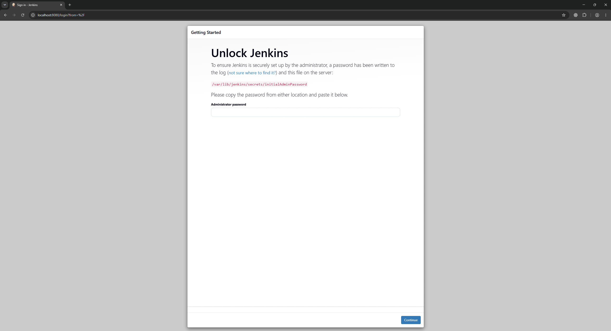

[View original-size PNG](evidence/screenshots/ss07-jenkins-unlock.png)

### SS08 - Jenkins dashboard

**Requirement:** Q1 | **Original document page:** 2

The configured Jenkins dashboard is accessible in the browser.

Open screenshot SS08

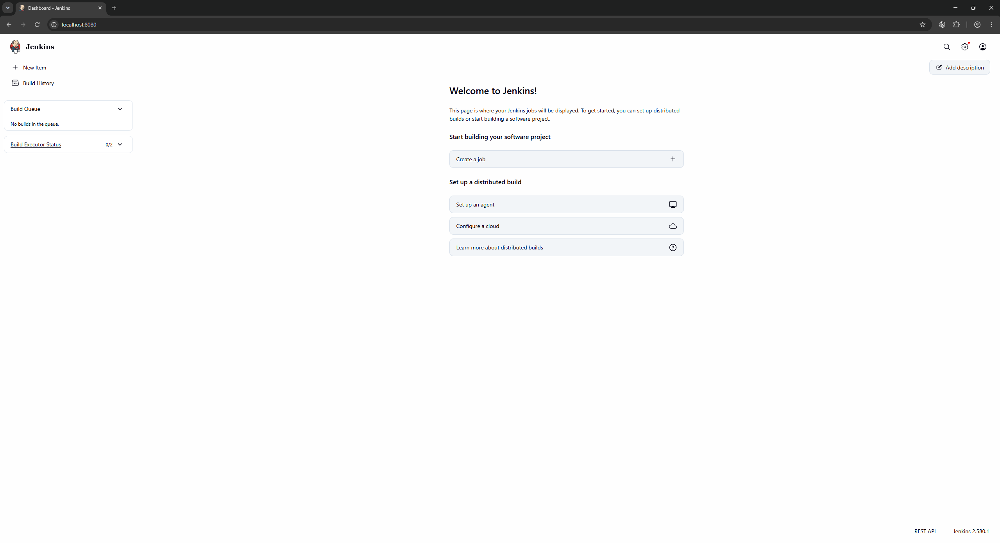

[View original-size PNG](evidence/screenshots/ss08-jenkins-dashboard.png)

### SS09 - Git global configuration

**Requirement:** Q1 | **Original document page:** 2

The screenshot shows user.name=axdy02 and a configured user.email. The original email remains visible.

Open screenshot SS09

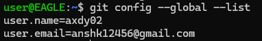

[View original-size PNG](evidence/screenshots/ss09-git-global-config.png)

## Q2 version control

### SS10 - Repository initialization

**Requirement:** Q2 | **Original document page:** 2

git status shows main and No commits yet.

Open screenshot SS10

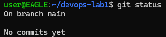

[View original-size PNG](evidence/screenshots/ss10-git-initialized.png)

### SS11 - First commit

**Requirement:** Q2 | **Original document page:** 2

The initial Python application and README commit is shown, followed by git log.

Open screenshot SS11

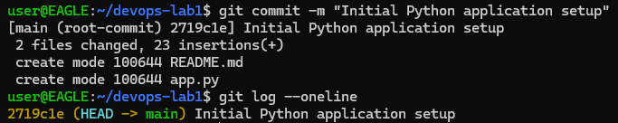

[View original-size PNG](evidence/screenshots/ss11-first-commit.png)

### SS12 - Feature branch

**Requirement:** Q2 | **Original document page:** 2

git switch -c feature-tests creates the branch and git branch lists it.

Open screenshot SS12

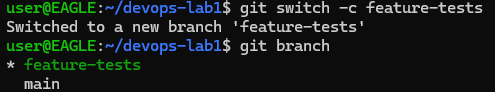

[View original-size PNG](evidence/screenshots/ss12-feature-branch.png)

### SS13 - Local unit tests

**Requirement:** Q2, Q4 | **Original document page:** 2

Both test_add and test_add_negative_numbers pass locally. This is not a Jenkins run.

Open screenshot SS13

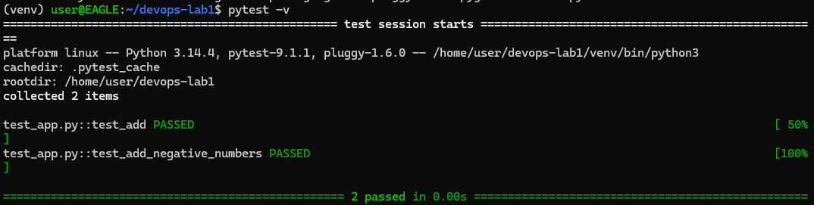

[View original-size PNG](evidence/screenshots/ss13-local-tests.png)

### SS14 - Feature commit history

**Requirement:** Q2 | **Original document page:** 3

The feature-tests branch contains the unit-test commit ahead of main.

Open screenshot SS14

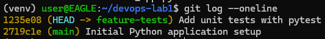

[View original-size PNG](evidence/screenshots/ss14-feature-commit.png)

### SS15 - Feature merge

**Requirement:** Q2 | **Original document page:** 3

git merge feature-tests completes as a fast-forward; the history includes both commits.

Open screenshot SS15

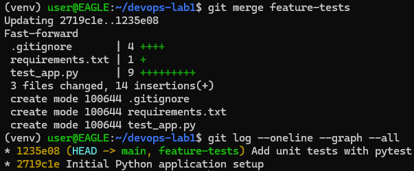

[View original-size PNG](evidence/screenshots/ss15-feature-merge.png)

### SS16 - Local branch history

**Requirement:** Q2, Q6 | **Original document page:** 3

main, docs-update and feature-tests references appear in the local decorated history.

Open screenshot SS16

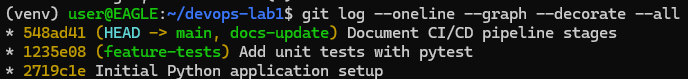

[View original-size PNG](evidence/screenshots/ss16-local-history.png)

### SS17 - GitHub repository created

**Requirement:** Q2 | **Original document page:** 3

The empty GitHub repository setup page is shown.

Open screenshot SS17

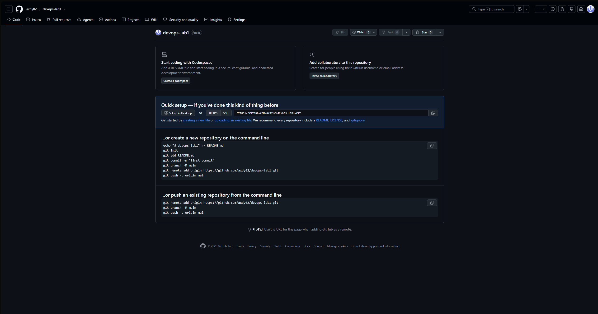

[View original-size PNG](evidence/screenshots/ss17-empty-github-repo.png)

### SS18 - GitHub authentication

**Requirement:** Q2 | **Original document page:** 3

gh auth status reports the axdy02 account. The token is masked in the source screenshot.

Open screenshot SS18

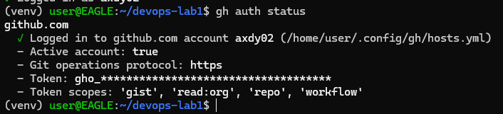

[View original-size PNG](evidence/screenshots/ss18-github-auth.png)

### SS19 - Successful GitHub push

**Requirement:** Q2 | **Original document page:** 4

git push -u origin main succeeds and configures upstream tracking.

Open screenshot SS19

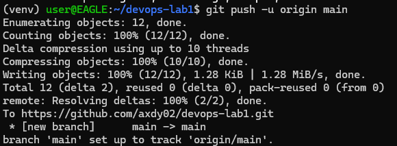

[View original-size PNG](evidence/screenshots/ss19-github-push.png)

### SS20 - Source files on GitHub

**Requirement:** Q2 | **Original document page:** 4

The initial source, tests, requirements and README appear on GitHub with three commits.

Open screenshot SS20

[View original-size PNG](evidence/screenshots/ss20-github-source.png)

## Q3-Q5 pipeline testing and local deployment

### SS21 - Pipeline file on GitHub

**Requirement:** Q3, Q4 | **Original document page:** 5

Jenkinsfile is present in the repository after the pipeline commit.

Open screenshot SS21

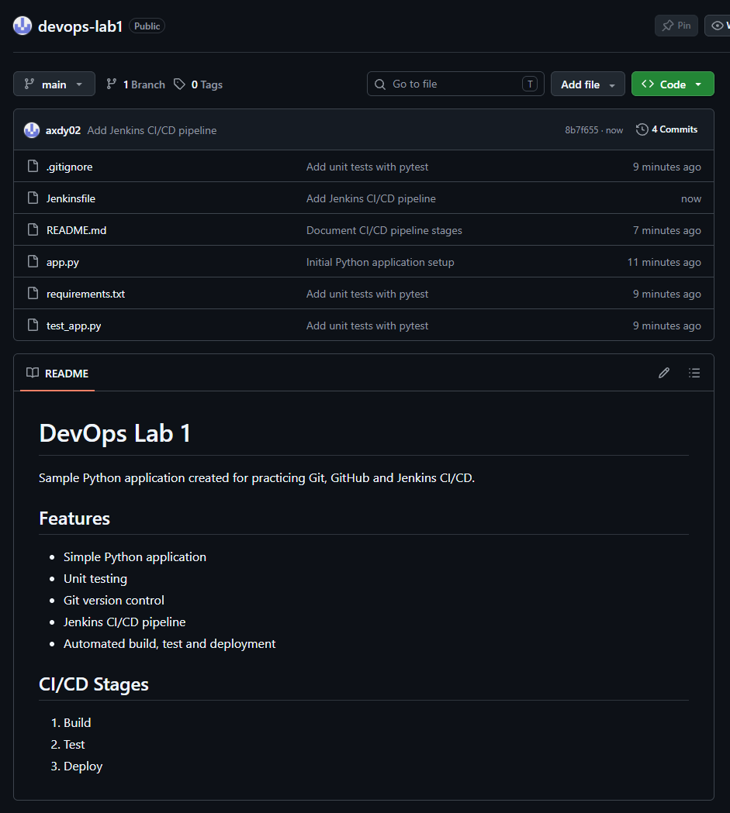

[View original-size PNG](evidence/screenshots/ss21-github-jenkinsfile.png)

### SS22 - Jenkins build 1 console

**Requirement:** Q3, Q4, Q5 | **Original document page:** 6

Build #1 shows two passing tests, the Deploy commands and application output, the success post action, and Finished: SUCCESS. The top of the checkout log is outside this screenshot.

Open screenshot SS22

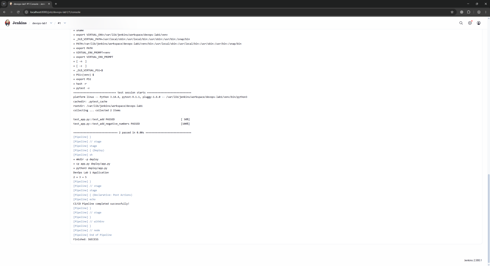

[View original-size PNG](evidence/screenshots/ss22-jenkins-console.png)

**Readable detail crop (SS22A):**

The crop changes the viewport only; the full original remains linked above.

### SS23 - Manual deployment check

**Requirement:** Q5 | **Original document page:** 6

The developer terminal copies and executes deploy/app.py. This is a manual check; Jenkins-run deployment is separately evidenced by SS22.

Open screenshot SS23

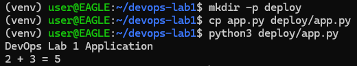

[View original-size PNG](evidence/screenshots/ss23-manual-deploy-check.png)

### SS24 - Second build appearing

**Requirement:** Q3, Q5 | **Original document page:** 6

The Build Time Trend view includes a second build. This view alone does not identify its trigger cause.

Open screenshot SS24

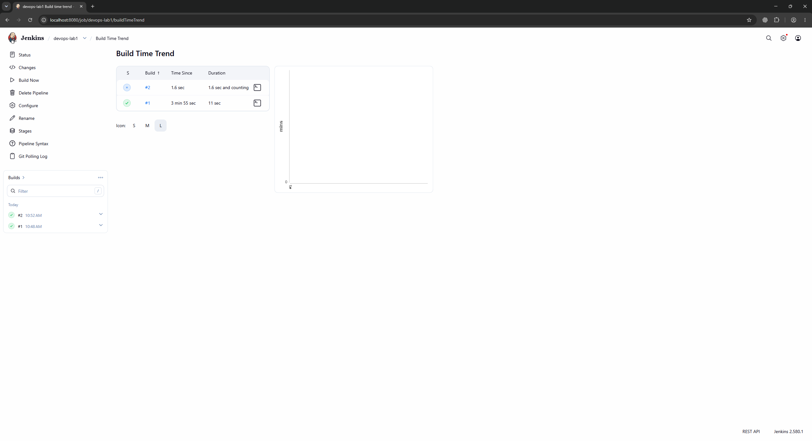

[View original-size PNG](evidence/screenshots/ss24-build-2-running.png)

### SS25 - Two successful builds

**Requirement:** Q3, Q5 | **Original document page:** 7

The Build Time Trend view shows builds #1 and #2 successful, with durations of 11 seconds and 5.4 seconds respectively. It does not show the trigger cause.

Open screenshot SS25

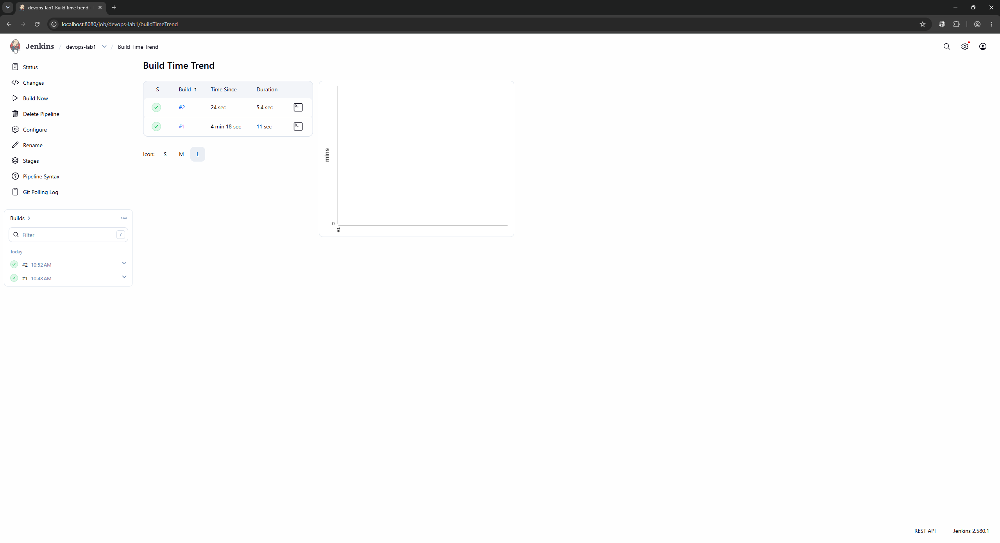

[View original-size PNG](evidence/screenshots/ss25-builds-successful.png)

**Readable result crop (SS25A):**

The trigger-cause line is not part of this view.

## Q6-Q7 command documentation and report

### SS26 - Command documentation commit

**Requirement:** Q6 | **Original document page:** 7

commands.txt is committed and pushed successfully.

Open screenshot SS26

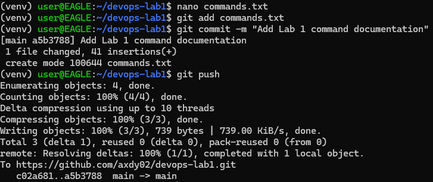

[View original-size PNG](evidence/screenshots/ss26-commands-commit.png)

### SS27 - Command documentation on GitHub

**Requirement:** Q6 | **Original document page:** 8

commands.txt is visible on GitHub; the README also contains the trigger-verification statement. That statement is not independent trigger evidence.

Open screenshot SS27

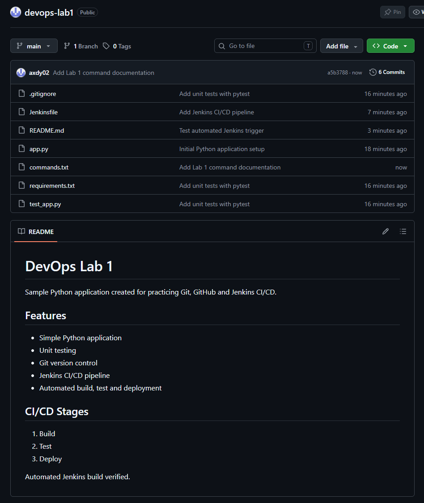

[View original-size PNG](evidence/screenshots/ss27-commands-on-github.png)

### SS28 - Report commit

**Requirement:** Q7 | **Original document page:** 9

REPORT.md is committed and pushed successfully.

Open screenshot SS28

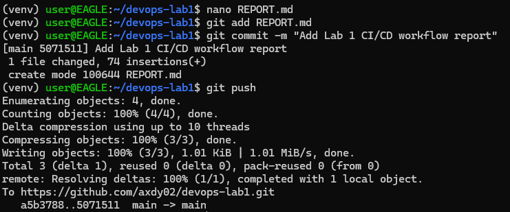

[View original-size PNG](evidence/screenshots/ss28-report-commit.png)

### SS29 - Report on GitHub

**Requirement:** Q6, Q7 | **Original document page:** 10

The repository contains REPORT.md, commands.txt, Jenkinsfile and the application files.

Open screenshot SS29

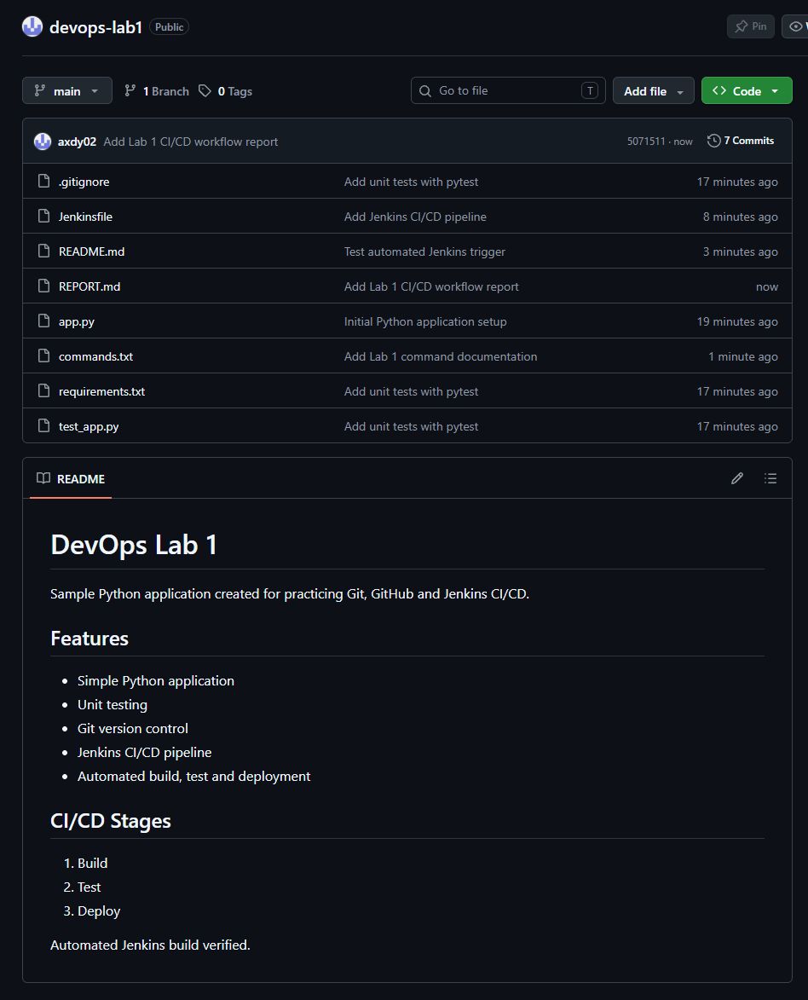

[View original-size PNG](evidence/screenshots/ss29-report-on-github.png)

## New evidence to add

After collecting the items in the [checklist](CHECKLIST.md), add the real screenshots and links here. No blank screenshots, fabricated output or placeholder success logs have been supplied. The original email remains visible in SS09, while the authentication token in SS18 is already masked in the source. Review the email-visibility choice before public upload.
